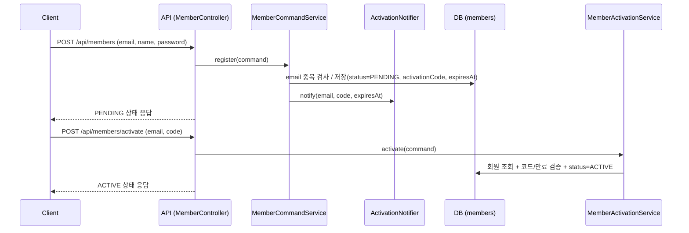
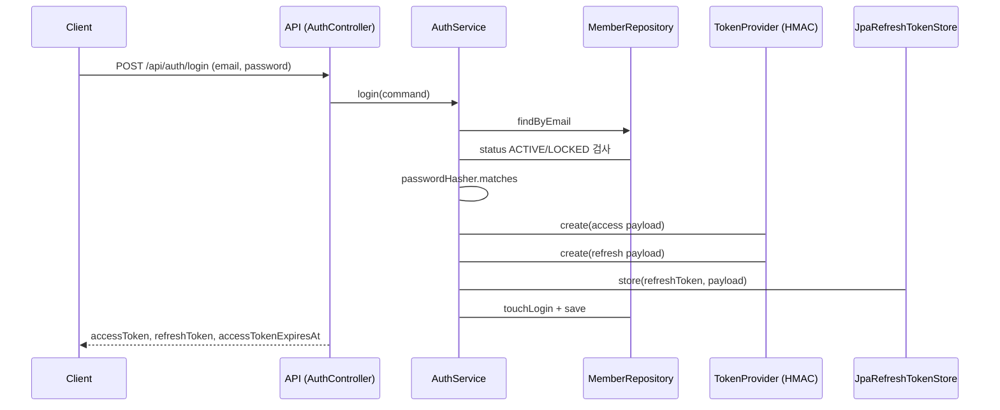
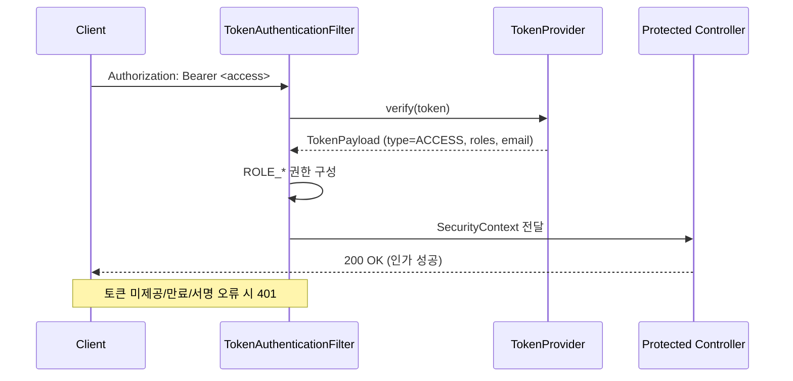
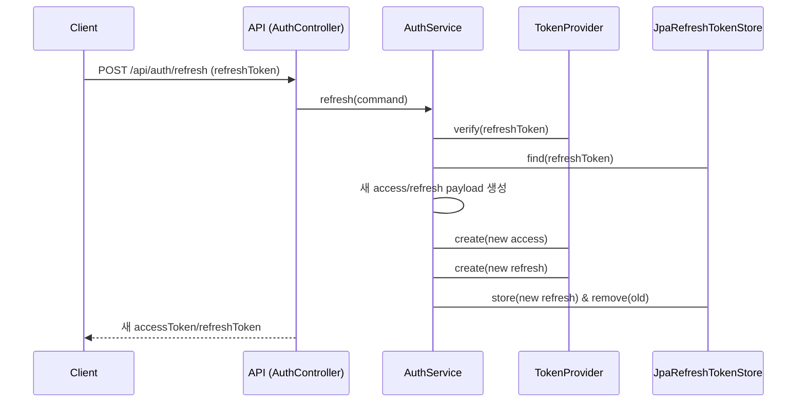

# 인증/인가 플로우 (Mermaid)

## 회원 가입 및 활성화

## 로그인과 토큰 발급

## 보호 API 접근 (액세스 토큰)

## 리프레시 토큰 재발급

## 역할/상태 기준 인가 정책
- 회원 상태: PENDING/LOCKED면 로그인·재발급 차단, ACTIVE만 허용.
- 역할→권한 매핑: TokenAuthenticationFilter가 `ROLE_<role>`로 주입. `@PreAuthorize("hasRole('USER')")` 등으로 컨트롤러 보호.
- 예외/응답: DomainException을 ApiExceptionHandler가 상태 코드로 매핑, 토큰 오류는 필터에서 401 처리.
